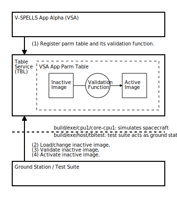

# NASA Core Flight System Table Validation

```
Copyright (c) 2024 Timothy Jon Fraser Consulting LLC

Licensed under the Apache License, Version 2.0 (the "License");
you may not use this file except in compliance with the License.
You may obtain a copy of the License at

   http://www.apache.org/licenses/LICENSE-2.0

Unless required by applicable law or agreed to in writing, software
distributed under the License is distributed on an "AS IS" BASIS,
WITHOUT WARRANTIES OR CONDITIONS OF ANY KIND, either express or
implied.  See the License for the specific language governing
permissions and limitations under the License.
```


This file provides a brief overview of the NASA Core Flight System
(cFS)'s table validation feature - the subject of our V-SPELLS cFS
challenge problems.  The diagram below depicts how human operators use
the cFS table validation feature during runtime. An understanding of
this workflow should be sufficient for tackling the challenges.



The default cFS configuration builds two programs each designed to run
in its own process: `core-cpu1` and `tbltest`. `Core-cpu1` simulates
a spacecraft. `Tbltest` is a functional test suite that takes the
place of the default cFS ground station simulator in our challenges.
The diagram shows the components of both programs that are relevant to
the table validation workflow. It separates the components of
`core-cpu1` from those of `tbltest` with a broad horizontal dashed
line.

The diagram shows three components as broad rectangles. The topmost
rectangle represents the mission-specific "V-SPELLS App Alpha" (VSA)
application or "app" created specifically for our challenge problems.
The middle rectangle represents the Table Service (TBL) that is
responsible for managing tables for apps. The bottom rectangle
represents a functional test suite that simulates human ground station
operators using the cFS table validation feature.

Tables are essentially memory buffers with an application-specific
field structure. Apps like VSA use them to store important parameters
that govern their behavior. Human operators can change the values of
these parameters at runtime. However, only certain parameter values
may be valid according to rules specific to each application. Invalid
values may cause the app to misbehave in a manner that leads to
mission failure - perhaps even to the loss of the spacecraft. TBL
implements a table validation feature to prevent such failures.

The diagram portrays the validation feature workflow as a series of
numbered steps alongside arrows representing interaction between
components. The following list explains each numbered step:

1) On startup, the VSA app asks TBL to manage its "VSA App Parm Table"
   table by registering it via TBL's `CFE_TBL_Register()` API
   function. During registration, the VSA app provides TBL with a
   pointer to a validation function for the VSA App Parm Table.  This
   validation function implements the VSA-specific rule checks that
   decide whether a table's values are valid or invalid. After
   registration, TBL to maintains two images for the table: an
   inactive one and an active one. Each image is essentially a copy of
   the table in memory.

2) During runtime, human ground station operators ask TBL to change
   the values of one or more VSA App Parm Table field values. (The
   cFS documentation uses the verb "load" rather than "change" for
   this operation.) TBL applies these changes to the table's inactive
   image and leaves the active image unchanged.

3) Once the human ground station operators feel they have made all
   their desired changes, they ask TBL to validate the table's
   inactive image. TBL executes the VSA App Parm Table validation
   function on the table's inactive image. The validation function
   checks the inactive image against VSA's table validity rules and
   determines whether it is valid or invalid. TBL remembers this
   result for use in the next step and sends a telemetry message to
   the ground station to inform the human operators. If the validation
   function reveals an invalid inactive table image, the human
   operators may repeat steps 2 and 3 until TBL informs them that they
   have arrived at a valid inactive table image.

4) Upon receiving telemetry indicating that the VSA App Parm Table's
   inactive image is valid, the human ground station operators ask TBL
   to activate the inactive image. If TBL sees that the validation
   function ran at least once since the last load operation and
   indicated the inactive image was valid, TBL will copy the contents
   of the inactive table image to the active table image. Otherwise,
   it will refuse to activate the inactive image and leave the active
   image unchanged. The VSA app will use parameter values only from
   the active image of its table; it does not see the human ground
   station operators' changes until they are validated and activated.

The phrase "TBL executes the table validation function" in step 3
above approximates a more complicated control flow.  Although all
components of the `core-cpu1` program execute in the same process, its
internal control logic dispatches control to the functions
implementing specific apps and specific framework components as if
they were separate real-time tasks. Each app uses the
`CFE_ES_PerfLogEntry()` and `CFE_ES_PerfLogExit()` API functions to
track how much time the `core-cpu1` spends executing their
functions. TBL actually asks the VSA app to execute its validation
function so that the time spent executing it is accounted to VSA and
not TBL.  The time performance of validation functions is relevant to
flight software correctness.

The TBL service is part of the general flight software framework
provided by cFS.  Engineers extend this framework with apps tailored
to their specific spacecraft and mission.  As noted in step 1 above,
apps extend TBL's generic functionality with app-specific validation
functions.  However, these validation function extensions are written
in C and provide no explicit safety or liveness properties.  They
execute in the same common address space as the app and all of the
other cFS components.  Our challenges focus on using V-SPELLS
techniques to provide a more secure validation function extension
mechanism without losing performance.
